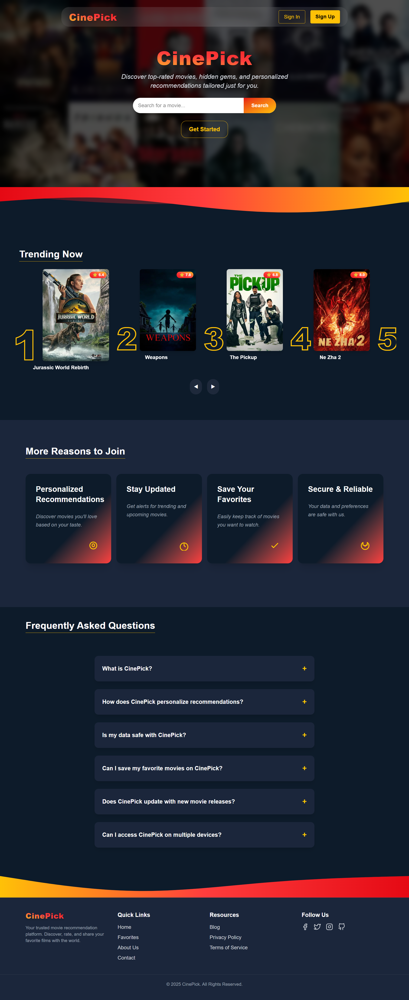
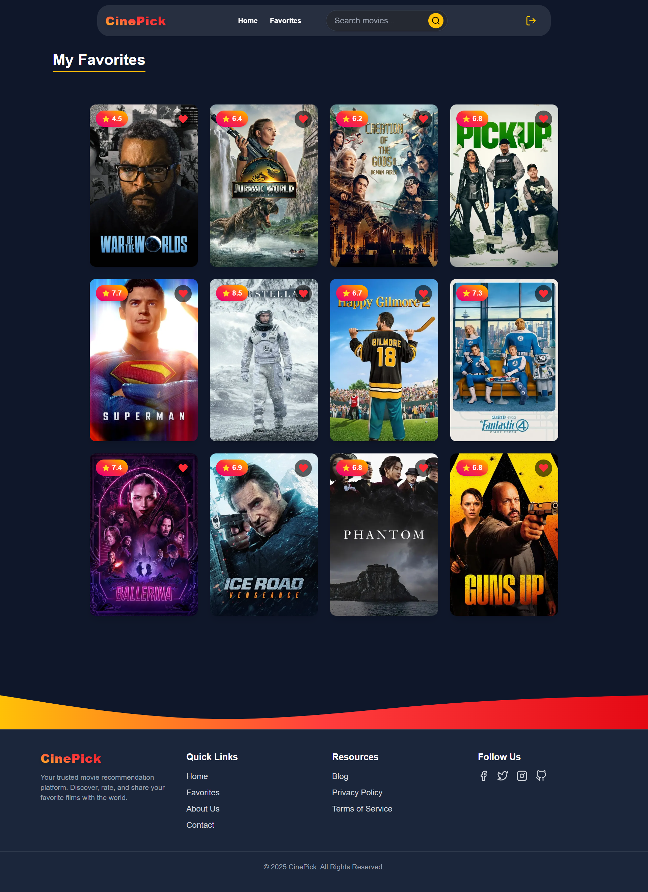

#  CinePick

CinePick is a **movie recommendation platform** that helps users discover trending, popular, and similar movies tailored to their preferences.  
Powered by a movie API, CinePick delivers a smooth, interactive, and responsive movie discovery experience.  

This project was built in collaboration as part of the **ALX ProDev program**:  
- **Frontend Developer:** Soumia Bellali *(me)* – Developed the user interface, implemented responsive design, integrated the movie API, and built user interaction features.  
- **Backend Developer:** Abdessamad Haddouche – Developed and managed backend services including authentication, favorites management, and API endpoints.  

---

##  Features

###  Core Functionality
- **Search Movies** – Quickly find movies by title.
- **Personalized Recommendations** – Suggest similar movies based on user-selected titles.
- **Trending & Popular Lists** – Stay up-to-date with the latest and most popular films.
- **Detailed Movie Pages** – Display posters, ratings, genres, descriptions, and release dates.
- **Favorites System** – Save and manage a personal favorites list for easy access.

###  User Experience
- **User Authentication** – Secure sign-up and sign-in to manage personal accounts.
- **Responsive Design** – Optimized for desktop, tablet, and mobile viewing.
- **Smooth Navigation** – Intuitive UI and seamless page transitions.

---

##  Project Structure
The **frontend** was built using **Next.js** and **Tailwind CSS** for rapid development and responsive styling.  
The **backend**, developed by **Abdessamad Haddouche**, handles user authentication, favorites management, and secure API communication.  


## Installation & Setup

Follow these steps to set up the project locally:

### 1️⃣ Clone the Repository

```bash
git clone https://github.com/Besomia22/alx-project-nexus.git
```

### 2️⃣ Navigate to the Project Folder

```bash
cd cinepick
```

### 3️⃣ Install Dependencies

```bash
npm install
```

### 4️⃣ Create an `.env.local` File

Inside the root folder, create a `.env.local` file and add your API key:

```env
NEXT_PUBLIC_API_URL=https://your-api-endpoint.com
NEXT_PUBLIC_API_KEY=your_api_key_here
```

If using authentication and favorites, also include:

```env
NEXT_PUBLIC_AUTH_API_URL=https://your-auth-api-endpoint.com
NEXT_PUBLIC_FAVORITES_API_URL=https://your-favorites-api-endpoint.com
```

### 5️⃣ Start the Development Server

```bash
npm run dev
```

Now open **http://localhost:3000** in your browser to see CinePick in action.

---

## Screenshots

| Landing Page                              | Home Page                                | Movie Details                                        | Favorites                                          |
| ----------------------------------------- | ---------------------------------------- | ---------------------------------------------------- | -------------------------------------------------- |
|  |  |  |  |


